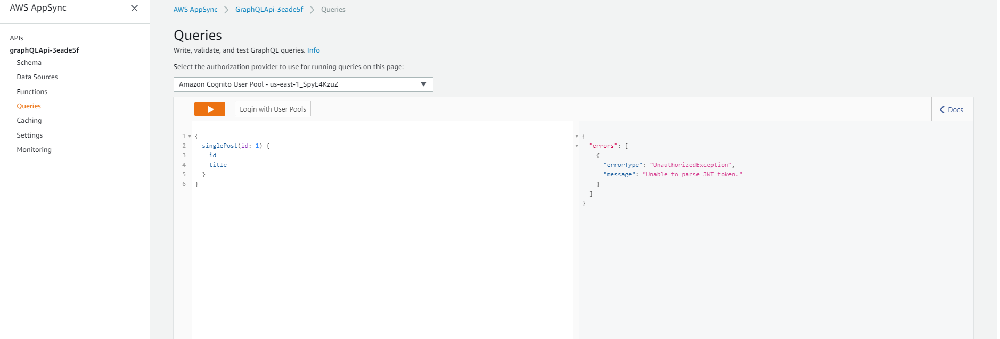
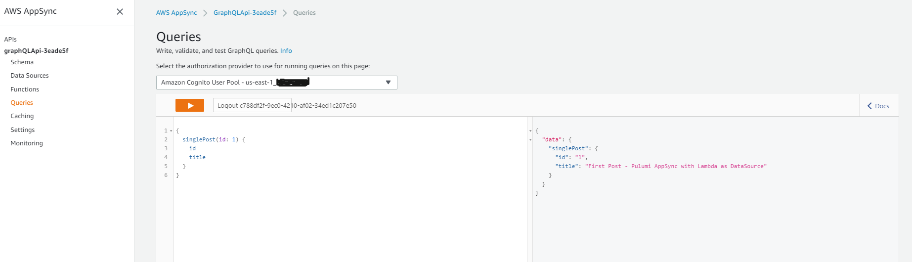
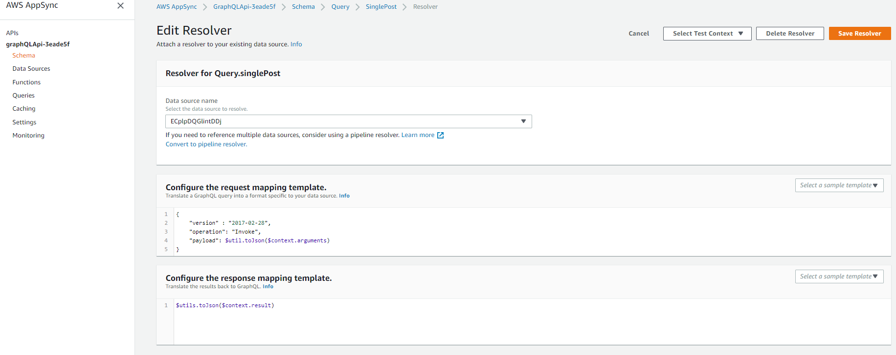

**This repo contains an example of Infrastructure as a code for creation AWS AppSync with Lambda as Datasource. It's based on Pulumi framework.**

## Preparation before deployment

```bash
$ git clone 'this repo'
$ nmp i
$ touch secret.js
```

_your secret.js file has to contain AWS Cognito user pool ID_

```nodejs
userPool = {
  id: 'us-east-1_XXXXXXXXX'
}

exports.userPool = userPool
```

## Deploy the stack:

https://www.pulumi.com/docs/get-started/aws/deploy-changes/#deploy-the-changes

```bash
$ pulumi up
```

> Resources: + 12 to create
>
> Do you want to perform this update? yes

## Testing GraphQL Query in AWS AppSync Console



You have to Log in using App Client ID and befohand created user in your AWS Cognito User Pool.



On the left side you can see our Query - singlePost from schema.qraphql file (which you can also find in AppSync Console --> Schema Tab).
On the right side, you can see the response.
Request to Lambda function goes through operations listed in request template mapping configurations.
After operations in Lambda function response goes throught operations listed in response template mapping configurations.



## Destroy resources

To destroy resources, run the following:
https://www.pulumi.com/docs/get-started/aws/destroy-stack/

```bash
$ pulumi destroy
```

> Resources: - 12 to delete
>
> Do you want to perform this destroy? yes

This example is inspired by the article
https://medium.com/@wesselsbernd/bff-back-end-for-front-end-architecture-as-of-may-2019-5d09b913a8ed

## Using files for lambda and req/res template mapping

In folder `qraphql/resolvers/lambdas/` we will store files that will contain our lambda functions for Appsync Resolvers.
In folder `qraphql/resolvers` we will store files that will contain request and response template mappings (naming convention you can find in the mentioned article above).
